# Enterprise Zero-Leak MCP Architecture Whitepaper

---

## I. Background & Motivation

With the rise of generative AI technologies such as Claude and ChatGPT being used as developer copilots, the **Model Context Protocol (MCP)** enables tools like the Claude Desktop App to convert user prompts into actual Git operations, issue creation, file queries, and project searches via local MCP Servers.

However:

> ⚠️ If Claude Desktop is paired with an uncontrolled MCP Server (e.g., the official gitlab-mcp-server), it may lead to:
> 
> - Source code leakage to LLMs for training or analysis
> - Exposure of private project structure and commit history
> - Users misconfiguring access tokens for over-privileged operations

To prevent source code and project data from being unintentionally exposed, a secure **Enterprise Zero-Leak MCP Architecture** is essential for internal governance.

---

## II. Zero-Leak Architecture Principles

| Objective | Description |
| --- | --- |
| Least Privilege | Only allow essential APIs (e.g., `create_issue`, `push_file`) and block high-risk operations (`get_file_contents`, `search_repositories`) |
| Isolated Deployment | MCP Server is deployed solely within enterprise-controlled environments (co-located with GitLab), with no open external ports |
| Sealed Proxy | All Claude Desktop requests **must pass through the enterprise MCP Server proxy** |
| Disallow User-Managed MCP | Enforced internal policy to prohibit usage of the official/default MCP Server or restrict via ACL |

---

## III. MCP Server Hardening Strategy

| Component | Implementation |
| --- | --- |
| MCP Source Code | Fork and customize the official MCP Server source code |
| `.env` Replacement | All configurations loaded via Claude Desktop’s `claude_desktop_config.json` |
| Disable Handlers | Use `DISABLED_HANDLERS` to block risky features like `get_file_contents` and `search_repositories` |
| Project Whitelisting | Restrict access via `ALLOWED_READ_PROJECTS` environment variable |
| Prevent stdout Echo | Avoid sending source code back to Claude (core of the Zero-Leak model) |

---

## IV. System Architecture Diagram

📌 Reference Diagram:

```mermaid
flowchart TD
    A[Claude Desktop App] -->|stdin/stdout JSON| B[MCP Proxy （Zero-Leak Server）]
    B -->|API Call via PAT| C[Self-Hosted GitLab API]
    subgraph Internal Network
        B
        C
    end

```

- Claude Desktop App sends requests to the local MCP Proxy
- The Proxy connects to a self-hosted GitLab instance (usually on intranet or VPN)
- MCP Server only permits authenticated operations with behavior logging
- All code-returning actions are blocked by design

---

## V. Risk Comparison (Traditional vs Zero-Leak MCP)

| Risk | Traditional GitLab Token | Zero-Leak MCP Architecture |
| --- | --- | --- |
| Arbitrary Repo Read Access | ✅ (if token has read scope) | ❌ (restricted handlers) |
| Arbitrary MCP Deployment | ✅ (user can deploy MCP locally) | ❌ (deployment restricted by company) |
| Claude Can Access Source Code | ✅ (`get_file_contents` supported) | ❌ (handler disabled, no code returned) |
| Token Leakage Risk | ✅ | ✅ (still requires secure key management) |

---

## VI. Recommendations for Enterprise Adoption

- Deploy MCP Server on the same machine as GitLab (or secure internal node)
- Use Docker containerization to lock specific image versions
- Central IT team should manage Claude Desktop’s `claude_desktop_config.json`
(block user override of MCP command or config)
- Integrate with DevSecOps pipeline for runtime audit of MCP logs and token usage

---